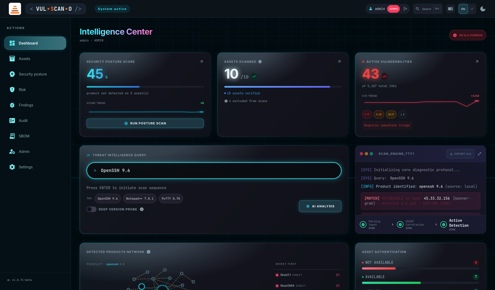
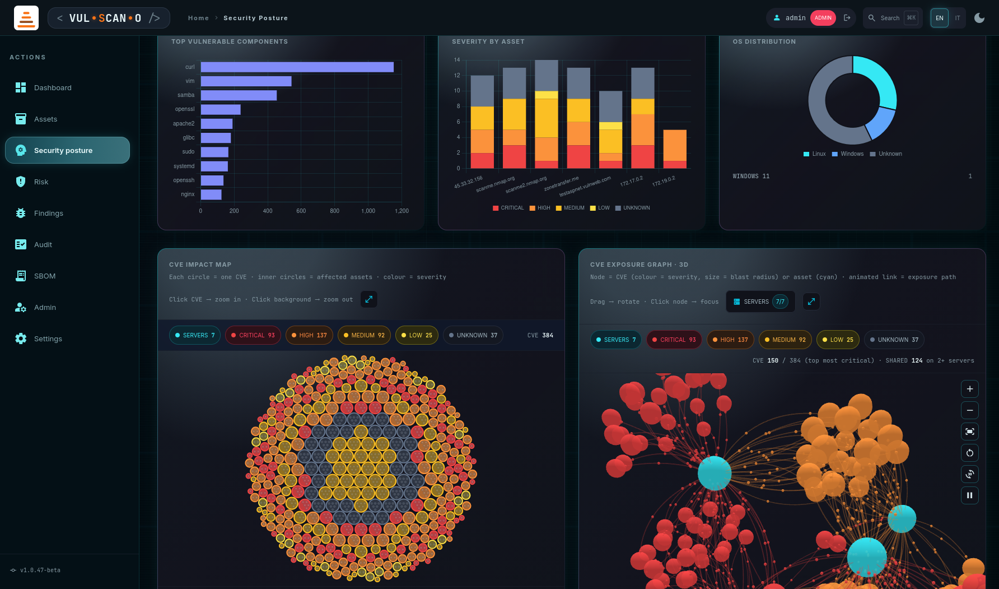
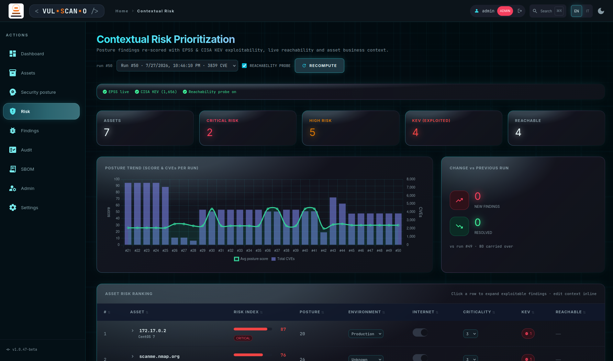
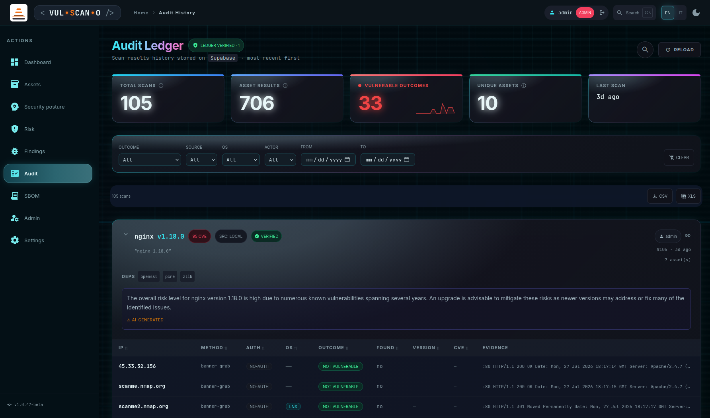

# VUL.SCAN.O

<p align="center">
  
</p>

<p align="center">
  <code>&lt;&nbsp;VUL&nbsp;&bull;&nbsp;<b>S</b>CAN&nbsp;&bull;&nbsp;O&nbsp;/&gt;</code>
</p>

<p align="center">
  
  
  
  
</p>

<p align="center">
  <a href="#ai-usage--eu-ai-act-regulation-20241689"></a>
  <a href="#transparency--human-oversight-art-50--good-practice"></a>
  <a href="#model-providers-and-data-flow"></a>
  <a href="#model-providers-and-data-flow"></a>
</p>

Web app for **authorized audits**: manages an asset inventory, identifies vulnerable software from a **free-text description** (even without an explicit CVE), runs network scans, enriches results with CVE data, and produces AI-driven security posture analysis.

Backend **FastAPI** · Frontend **HTML + Tailwind** (CDN) · real-time results via **Server-Sent Events** · persistence on **local Supabase (Docker)**.


> ⚠️ **Responsible use.** Only run scans or logins against assets you own or are explicitly authorized to test. Scanning third-party systems without permission is illegal.

📖 **User manual** — a bilingual (EN/IT) guide with one chapter per page, the role matrix, the API reference and the formulas: `static/manuale_uso/index.html`, served by the running app at `/static/manuale_uso/index.html`. The book icon in the top bar, next to the search trigger, opens it in a new tab in the language and theme you are currently browsing in.






---

## Who it's for

The product is built around a small number of **people**, each of whom maps to
exactly one of the [six RBAC roles](#roles). Roles describe **capabilities, not
job titles**: several personas legitimately share one role, and that is
deliberate — three near-identical roles would only drift apart over time.

| Persona | Role | What they come here to do | Where they live |
|---|---|---|---|
| **CISO / CSO** | `auditor` | Read the posture number and its trend, then pull the signed evidence when someone asks for proof. Never changes state. | `/`, `/risk`, `/audit` |
| **Compliance officer, external auditor** | `auditor` | Answer *"how many criticals were open on 31 March, and prove it"*: point-in-time evidence, hash-chain verification, NIS2 art. 21(2) and OWASP mapping. | `/audit`, `/api/findings/as-of` |
| **Vulnerability management lead, security manager** | `manager` | Prioritise with EPSS/KEV plus asset business context, own the SLAs, hand work out by assigning visibility cones, open tickets. | `/risk`, `/findings`, `/assets` |
| **Security / vulnerability analyst** | `editor` | The daily operator: triage findings, run scans, import Trivy/Grype/Nuclei/Semgrep reports, apply the multi-source fix plan. Sees only their assigned assets. | `/findings`, `/intel`, `/` |
| **DevSecOps / AppSec engineer** | `editor` | Export CycloneDX 1.5 / SPDX 2.3 for the pipeline, import SAST and secret-scanning output, push findings to GitHub Issues or Jira. | `/sbom`, `/findings` |
| **Pentester, authorized external tester** | `editor` or `manager` | The active side: network scans, free-text software identification without a CVE, OSINT enrichment — strictly on assets they are authorized to test. | `/intel`, `/`, `/assets` |
| **Platform / IT administrator** | `admin` | Installs and keeps it running: accounts and groups, SMTP, AI provider, ticketing credentials, the Supabase stack. Does no security work. | `/admin`, `/settings` |
| **System or asset owner, department head** | `stakeholder` | Non-security: sees the patch status of *their own* hosts and what to do about it — read-only, and only inside their cone. | `/`, `/findings`, `/risk` |
| **Board observer, executive stakeholder** | `viewer` | Fleet-wide numbers, read-only, no audit ledger (it names people). | `/`, `/risk` |
| **MSSP / consultancy** | `admin` + groups | One instance, several clients kept apart by `asset_assignments`; the signed evidence report is the deliverable. | `/admin`, `/audit` |

**Who it is *not* for.** There is no SOC L1 / incident responder persona: the
product has no alerting, no webhooks, no SIEM integration and no real-time
detection. It is an **ASPM / vulnerability management** tool — it tells you what
is exposed and whether it got better since last month, not that something is
happening right now.

> **One thing worth staffing explicitly.** The contextual risk score in
> [`risk.py`](risk.py) is driven by `environment`, `internet_facing` and
> `criticality` on each asset. Nobody owns those fields by default. Left at
> `criticality = 3`, contextual prioritisation degrades to plain CVSS ordering
> — decide early who fills them in (usually the manager, with input from the
> stakeholder who owns the system).

---

## Minimum requirements

### Operating system

| | Supported |
|---|---|
| **OS** | Linux x86_64 or arm64 (Debian/Ubuntu, Fedora/RHEL, Alpine, Arch, openSUSE — any distro with `apt`/`dnf`/`yum`/`apk`/`pacman`/`zypper`) |
| **Also works** | Windows via **WSL2** (with Docker), Proxmox **VM** (LXC containers need `nesting=1,keyctl=1` for Docker) |
| **Not supported** | Native Windows/macOS (the stack relies on Linux Docker, `systemd`/init and `/dev/kvm`) |

### Hardware

| Profile | CPU | RAM | Disk |
|---|---|---|---|
| **Minimum** (app + Supabase, remote AI via Claude API) | 2 cores x86_64/arm64 | 4 GB | 10 GB free |
| **Recommended** (local AI with Ollama `qwen2.5:7b`) | 4 cores | 12 GB (~6 GB used by the 7B model) | 20 GB free (model ~4.7 GB) |
| **+ Windows test VM** (`dockurr/windows`) | 4+ cores **with VT-x/AMD-V enabled in BIOS** + KVM module loaded (`/dev/kvm`) | +4 GB dedicated to the VM | +40 GB (Windows 11 image + storage) |

Rules of thumb: each extra Ollama model adds its own size on disk (4–5 GB for 7B-class models); the Linux test container is negligible (~500 MB).

### Software (auto-installed by `start.sh` when missing)

- **Python 3.10+** with `venv`
- **Docker** + `docker compose` v2 plugin (local Supabase stack)
- **Go ≥ 1.21** (one-time `encdec` build)
- `curl`, `git`
- **Ollama** — only if you choose the local AI provider in the wizard

### Network & client

- Internet access at install time (packages, Docker images, Go/Ollama downloads) and at runtime for OSV/CVE feeds, OSINT search and GitHub update checks; runtime AI is fully offline with the local Ollama provider
- Free local ports: **8000** (app), **8001** (Supabase REST), **3001** (Studio GUI) — plus **2222/3389/8006** if you create the Windows test VM
- A modern browser with **WebGL** enabled (the 3D CVE impact graph requires it)

---

## Installation

Requires: **Python 3.10+**, `pip`, `venv`, `curl`, `git`, **Docker** (with the `docker compose` v2 plugin), **Go ≥ 1.21** (to build `encdec`).
On Debian/Ubuntu: `sudo apt install python3-pip python3-venv curl git golang docker-compose-plugin`

**Missing dependencies are installed automatically.** At every launch `start.sh` runs a preflight on `python3`/`venv`/`curl`/`git` and, before using them, checks Go (≥ 1.21), Docker (binary + running daemon) and the `docker compose` v2 plugin: anything missing is installed via `apt` (sudo prompt) — if `apt` is unavailable or the install fails, the script aborts with manual instructions.

> **Go tarball fallback.** If the package manager doesn't provide Go ≥ 1.21 (e.g. Debian 12), `start.sh` downloads the latest official release from `go.dev` and installs it to `/usr/local/go`. The script exports `PATH=/usr/local/go/bin:$PATH` **only for its own session**: to use that Go in your shell too, add the same line to `~/.bashrc` (prepend, not append, or a `go` from apt in `/usr/bin` will take precedence). Do **not** set `GOROOT` manually — each Go binary auto-detects its own. Not needed on Ubuntu 24.04, whose `golang` package (1.22) already satisfies the requirement. **Ollama and the default LLM** do not need to be pre-installed either. In the wizard, choosing the local provider asks **whether to install Ollama** (official `ollama.com` script) and **which model to use**: `qwen2.5:7b` (default), `llama3.1:8b`, `mistral:7b` or any custom name. The choice is saved in `config.json` (`ai.ollama_autoinstall`, `ai.ollama_model`). Then at **every launch**, if the provider is Ollama with a local URL, the script installs Ollama if missing (unless the user opted out in the wizard), starts the server if needed, pulls the configured model if absent and verifies via `/api/tags` that it is actually available.

### First run (interactive wizard)

```bash
git clone <repo>
cd vul.scan.o
chmod +x start.sh stop.sh
./start.sh
```

As an alternative to `clone`, you can always download the artifact for a **tag/release** as a `.zip` package (repo *Tags* page → *Download ZIP*, or `<repo>/archive/refs/tags/<tag>.zip`): extract it and continue from `cd vul.scan.o` onward.

To update an existing installation, see [Application updates](#application-updates) (`./start.sh update` → option 4).

---

## `start.sh` — startup and configuration

The script is the single entry point. It handles, in sequence: password encryption, AI/search configuration, Docker test machine, virtualenv, Supabase and the FastAPI server.

### Execution phases 

```
start.sh
 │
 ├─ 0) Preflight         ──► python3 / venv / curl / git: auto-install via apt if missing
 │
 ├─ 1) encdec setup      ──► first run: asks for a secret prefix → patches source → compiles binary (Go ≥ 1.21 verified)
 │                            later runs: binary already present, no interaction
 │
 ├─ 2) Wizard / Update
 │     ├─ AI provider    ──► Local Ollama  |  Claude API
 │     ├─ Search engine  ──► DuckDuckGo    |  Serper
 │     └─ Docker test    ──► creates a vulnerable Linux machine (optional)
 │
 ├─ 2b) AI precheck      ──► provider ollama: install ollama + pull default LLM (qwen2.5:7b) if missing
 ├─ 3) Virtualenv        ──► creates .venv, installs requirements.txt
 ├─ 4) Supabase          ──► starts Docker stack (skippable with --no-supabase)
 └─ 5) FastAPI           ──► exec uvicorn app:app --host 127.0.0.1 --port $PORT
```

### Startup modes

```bash
./start.sh                        # normal startup (port 8000)
PORT=9000 ./start.sh              # custom port
./start.sh --no-supabase          # skip Supabase
./start.sh update                 # config-edit menu
./start.sh update --no-supabase   # edit config without Supabase
```

### First-run wizard

On first run (no `config.json`) the wizard asks for:

1. **encdec secret prefix** — entered once; compiled into the binary (see the Password Encryption section)
2. **AI model**:
   - `Local` → Ollama: asks whether to install it if missing, model menu (`qwen2.5:7b` default, `llama3.1:8b`, `mistral:7b`, or custom), then starts the server, runs `ollama pull`, verifies the model via `/api/tags`
   - `Remote` → Claude API (requires API key)
3. **OSINT search engine**:
   - `DuckDuckGo` — free, no API key
   - `Serper` — Google results, requires API key
4. **Docker Linux test machine** — optional (see dedicated section)

### Application updates

The app checks GitHub for a newer tag than the local version (the one shown
bottom-left in the sidebar):

- **In the UI** — a discreet, dismissible banner appears at the bottom-left of
  every page when a newer tag exists on GitHub ("New version vX available —
  update with ./start.sh update"). The check runs server-side
  (`GET /api/version/check`) and is cached for 6 hours; dismissing the banner
  hides it until the *next* version. Repo overridable with the
  `VFA_GITHUB_REPO` env var.
- **From the CLI** — `./start.sh update` → "Controlla aggiornamenti
  applicazione (GitHub)": compares the local git tag with the latest GitHub
  tag and, on confirmation, downloads the sources:
  - with a `.git` checkout: `git fetch --tags` + `git checkout <tag>`
    (aborts if there are uncommitted local changes);
  - without git: downloads the release tarball and applies it with `rsync`,
    **preserving runtime files** (`config.json`, `.venv/`, `.encdec/`,
    `.vfa_auth_secret`, Supabase data, logs).

  Then relaunch with `./start.sh`: dependencies and DB schema are realigned
  automatically at startup.

#### How to update, step by step

```bash
# 1. Stop the app (FastAPI + Supabase stack)
./stop.sh

# 2. Open the update menu and pick option 4
./start.sh update
#    Cosa vuoi modificare?
#      ...
#      4) Controlla aggiornamenti applicazione (GitHub)
#    -> shows local vs latest version, asks "Scaricare e installare ora? [s]"

# 3. Relaunch: venv dependencies and the DB schema are realigned automatically
./start.sh
```

Notes:

- **What is never touched by an update**: `config.json` (wizard config and API
  keys), `.venv/`, the `encdec` binary with your compiled secret
  (`.encdec/`), the session-token secret (`.vfa_auth_secret`), the Supabase
  data volume (scan history, users, findings) and the log files.
- **Git checkout with local edits**: the updater refuses to run if
  `git diff` is dirty — commit or stash your changes first, then retry.
- **Rollback (git installs)**: every release is a tag, so
  `git checkout <previous-tag>` followed by `./start.sh` brings you back.
- Users are notified in the web UI too: a dismissible banner at the
  bottom-left appears on every page when a newer version exists.

### `update` menu

```bash
./start.sh update
```

Shows the current configuration and lets you:

| Option | Action |
|---|---|
| 1 | Change AI provider (Ollama ↔ Claude) |
| 2 | Change search engine (DuckDuckGo ↔ Serper) |
| 3 | Create/start Docker Linux test machine |
| 4 | Check for application updates on GitHub (and download them) |
| 5 | Save and exit (config only, doesn't launch the app) |
| 6 | Save and launch the app |

---

## `stop.sh` — full shutdown

```bash
./stop.sh
```

Runs in sequence:

1. **Shuts down the Supabase stack** (`docker compose down`) — data persists in `supabase/volumes/db/data`
2. **Removes the test container** `vuln-test-linux-1` if present (`docker rm -f`)

The FastAPI server stops separately with `Ctrl+C` in the terminal running `start.sh`.

---

## Asset password encryption (`encdec`)

Asset passwords are encrypted at rest via the [encdec](https://github.com/daniloritarossi/encdec) binary.

### How it works

| Phase | Detail |
|---|---|
| **First build** | `start.sh` asks for a secret prefix (with confirmation), patches `defaultSecretKeyPrefix` in `lib/lib.go` and builds the binary at `.encdec/encdec` |
| **Later runs** | Binary already present → no interaction, no password prompt |
| **Secret** | Compiled into the binary; never on disk or in environment variables |
| **Algorithm** | Machine-bound AES-GCM with an application prefix (`ENC`/`DEC`) |
| **Format in `assets` table** | `ENC:<hex-ciphertext>` |

### Encrypt/decrypt flow

```
UI enters password      →  POST /api/assets
                            └─ crypto.encrypt_password()
                               └─ encdec ENC <plain>  →  ENC:<hex>  →  Supabase table 'assets'

Asset SSH login         →  scanner._scan_auth_real()
                            └─ crypto.decrypt_password(ENC:<hex>)
                               └─ encdec DEC <hex>  →  plaintext password  →  paramiko
```

### `crypto.py` module

| Function | Behavior |
|---|---|
| `encrypt_password(plain)` | Calls `encdec ENC`, prefixes with `ENC:`, returns the encrypted string |
| `decrypt_password(stored)` | String without `ENC:` → returned unchanged (backward compat.); `ENC:` string → calls `encdec DEC` |
| `is_encrypted(val)` | `True` if the string starts with `ENC:` |

> If the password isn't encrypted (plaintext), the app flags it with an orange **NOT ENCRYPTED** badge on the Asset Inventory page and rejects SSH login during the health check.

---

## Test machines (Docker)

The wizard (first run or `./start.sh update` → option 3) asks **which** test machine to create:

```
Which test machine do you want to create?
  1) Linux   — Ubuntu 20.04 + SSH + Python 3.6 (outdated)
  2) Windows — Win 11 (KVM) + Notepad++ 7.8.1 + PuTTY 0.70 (vulnerable)
  3) None    — skip
```

Both use `admin` / `admin` credentials and, once setup finishes, offer the same "Add to asset inventory?" submenu (encrypted / plaintext / No). The asset is inserted into the Supabase `assets` table via PostgREST.

### Linux — specs

| Parameter | Value |
|---|---|
| Base image | `ubuntu:20.04` |
| Python | 3.6 (via the `deadsnakes` PPA — intentionally outdated version) |
| SSH | `openssh-server`, `PasswordAuthentication yes`, `PermitRootLogin no` |
| User | `admin` / password `admin` (in the `sudo` group) |
| Container name | `vuln-test-linux-1` |
| Network | Docker bridge (`172.17.0.x`) |

Idempotent build: on every run the wizard rewrites the `Dockerfile`, rebuilds the `vuln-test-linux` image, and removes/recreates the `vuln-test-linux-1` container.

### Lifecycle

```bash
# Creation (via wizard)
./start.sh update   # → option 3

# Verification
ssh admin@172.17.0.2       # password: admin
python3.6 --version         # Python 3.6.x (outdated, via deadsnakes)

# Stop and removal
./stop.sh                   # removes the container automatically
```

### "Add to asset inventory?" submenu

After the container starts, the wizard asks whether to add it to the inventory, with three choices:

| Option | Behavior |
|---|---|
| 1 — encrypted credentials | Encrypts `admin` with `encdec` and saves `ENC:<hex>`. If the `encdec` binary is missing or encryption fails, it warns explicitly and falls back to plaintext |
| 2 — plaintext password | Saves `admin` in plaintext (no encryption attempted) |
| 3 — No | Doesn't modify the inventory |

The asset is inserted with `username=admin`, `os_type=linux`.

### Windows — specs

Windows doesn't run as a native container on a **Linux** Docker host: the native Windows images (`mcr.microsoft.com/windows/nanoserver`, `servercore`) only have Windows manifests — `docker pull` fails with `no matching manifest for linux/amd64` and they only run on a **Windows** Docker host. On top of that, `nanoserver` is headless (no `winget`, no GUI) → it can't host Notepad++/PuTTY.

That's why the wizard uses **[`dockurr/windows`](https://github.com/dockur/windows)**, which boots a real Windows 11 VM via **QEMU/KVM** inside a Linux container. **Requires `/dev/kvm`**. If `/dev/kvm` is missing the wizard **won't proceed** and prints a matching guide (see below). The BIOS guide appears **only** in that case: when KVM is already active it's not shown.

#### Prerequisite: hardware virtualization (KVM)

Any local Windows VM — **dockurr/KVM, VirtualBox, VMware, Hyper-V** — requires hardware virtualization **VT-x (Intel) / AMD-V "SVM" (AMD)**. Without it, a 64-bit Windows guest won't boot. It's the same prerequisite for every local solution; the only exception is software emulation via QEMU-TCG (see alternatives).

Check and enable it:

```bash
ls -l /dev/kvm            # if it exists, KVM is already active: no action needed
lscpu | grep -i virtual   # shows "AMD-V" or "VT-x" if the CPU exposes it
sudo modprobe kvm_amd     # loads the module (Intel: kvm_intel)
```

| Symptom | Cause | Action |
|---|---|---|
| `/dev/kvm` present | KVM active | None — the wizard proceeds |
| No `svm`/`vmx` flag in `/proc/cpuinfo` | Virtualization **disabled** in BIOS | Enable it in BIOS (below) |
| Flag present but `modprobe` → `Operation not supported` | SVM/VT-x **locked** in BIOS (flag visible, feature locked) | Enable it in BIOS (below) |
| `modprobe` succeeds but `/dev/kvm` disappears after reboot | Module not persistent | `echo kvm_amd \| sudo tee /etc/modules-load.d/kvm.conf` |

**Enabling virtualization in BIOS/UEFI** (e.g. Lenovo Yoga Slim 7, AMD):

1. **Full** reboot (not suspend).
2. On power-on press **F2** (or **Fn+F2**); alternatively the **Novo** button/hole → *BIOS Setup*.
3. **Configuration** (or *Advanced*).
4. **SVM Mode** (aka *AMD-V* / *Virtualization* / *VT-x*) → **Enabled**.
5. **F10** → *Save and Exit* → confirm.

After reboot, finish and persist:

```bash
sudo modprobe kvm_amd                                  # (Intel: kvm_intel)
echo "kvm_amd" | sudo tee /etc/modules-load.d/kvm.conf # persists across reboots
sudo usermod -aG kvm "$USER"                           # then logout/login
ls -l /dev/kvm                                          # crw-rw---- root kvm
```

**No-BIOS alternatives** (if you can't/don't want to touch firmware):

- **Software emulation (QEMU-TCG):** in `docker-test-machine-windows/compose.yml` add `KVM: "N"` under `environment`. Works without `/dev/kvm` but is **very slow** (Windows installation = hours).
- **External Windows host:** a cloud VM (e.g. **AWS Free Tier**, Windows Server `t3.micro`, 750 h/month for 12 months) or a Windows PC on your LAN. Enable OpenSSH + install Notepad++/PuTTY and add the IP to the asset inventory with `os_type = windows`. No local virtualization needed.

| Parameter | Value |
|---|---|
| Image | `dockurr/windows` (Windows 11 VM via KVM) |
| Vulnerable software | **Notepad++ 7.8.1**, **PuTTY 0.70** (installed on first boot from `oem/install.bat`) |
| Scan access | **OpenSSH** with default PowerShell shell (guest port 22) |
| User | `admin` / password `admin` |
| Host ports | `3389` RDP · `2222`→22 SSH · `8006` dockurr install viewer |
| Container name | `vuln-test-windows-1` |
| Generated files | `docker-test-machine-windows/compose.yml`, `docker-test-machine-windows/oem/install.bat` |

```bash
# Creation (via wizard) — the first Windows install takes minutes
./start.sh update   # → option 3 → 2 (Windows)

# Installation progress
http://localhost:8006        # dockurr viewer

# Stop and removal (including the Windows container)
./stop.sh
```

> ⚠️ Authenticated Windows scanning only works **once installation is complete** (OpenSSH active + Notepad++/PuTTY installed). The installer URLs in `oem/install.bat` point to deliberately outdated, vulnerable versions.

#### Waiting for the image download

On first run dockurr **downloads the Windows 11 ISO from Microsoft's servers** (several GB): depending on your connection this can take **tens of minutes**. Until the download and subsequent installation finish, **the VM isn't reachable** and `ssh ...` returns `Connection refused`. You need to **wait** until the image is downloaded and installed before scanning.

Check download/install status:

```bash
docker logs -f vuln-test-windows-1
```

The log phases proceed like this:

```
Downloading Windows 11...        ← ISO download (shows % and ETA, e.g. "13%  44m16s")
Extracting / Installing...       ← installation
Booting Windows...               ← first boot
oem/install.bat                  ← OpenSSH + Notepad++ 7.8.1 + PuTTY 0.70
```

Alternatively, the **web viewer** shows graphical progress:

```
http://localhost:8006
```

Once the log reaches the `oem/install.bat` run (OpenSSH active), the asset becomes scannable:

```bash
ssh admin@localhost -p 2222 "winget list"   # password: admin — should list Notepad++/PuTTY
```

### Windows scan logic

When an asset has `os_type = windows`, the authenticated path (`scanner._scan_auth_real`) runs a software inventory over SSH with PowerShell instead of the Linux command (`dpkg`):

```powershell
# 1. Standard programs (Winget)
winget list

# 2. Deep registry: 32- and 64-bit software that winget misses
Get-ItemProperty `
  HKLM:\Software\Wow6432Node\Microsoft\Windows\CurrentVersion\Uninstall\* , `
  HKLM:\Software\Microsoft\Windows\CurrentVersion\Uninstall\* `
  | Select-Object DisplayName, DisplayVersion
```

The output (`DisplayName` / `DisplayVersion`) is matched against the target product's aliases (`notepad++` → `notepad++`/`npp`/`notepad plus plus`; `putty` → `putty`); the first `X.Y[.Z]` version on the matching line becomes the `detected_version`. Method reported in results: `auth-ssh-win`.

> These commands only run if `scanner.simulate_auth: false` in `config.json` (real SSH login). With `simulate_auth: true` (default) the outcome is simulated and deterministic, independent of the OS.

---

## Architecture

```
start.sh ──► encdec setup ──► wizard config.json ──► .venv + deps ──► Supabase ──► FastAPI
```

| File | Role |
|------|------|
| `app.py` | FastAPI server: page routing + REST API + SSE + SSH health check |
| `auth.py` | Authentication & RBAC: PBKDF2 password hashing, signed session cookies, role dependencies, visibility cones, one-time tokens, rotation policy |
| `mailer.py` | Transactional email (SMTP): account activation and password-reset links — never passwords |
| `crypto.py` | encdec wrapper: asset password encryption/decryption |
| `config.py` | Reads/writes `config.json`; embedded defaults |
| `osint.py` | Identifies product and version from free-text description |
| `scanner.py` | Asset scanning: TCP banner grabbing + SSH audit (with password decrypt) |
| `cve.py` | CVE lookup on OSV.dev + AI summary + remediation; orchestrates the fix-plan source cascade |
| `nvd.py` | NVD (NIST) source: CPE resolution + version-range matching for software OSV does not index |
| `msrc.py` | Microsoft MSRC source: monthly CVRF index → fixed builds and KB numbers for Microsoft products |
| `posture.py` | Per-asset SCA: package inventory + OSV |
| `ingest.py` | Ingests external scanner reports (Trivy, Grype, Nuclei, Semgrep, Gitleaks, Trufflehog) |
| `findings.py` | Finding lifecycle: fingerprint dedup, workflow states, SLA |
| `localscan.py` | Optional local scanner wrappers: gitleaks (secrets), trivy image (vuln+secret) |
| `compliance.py` | Compliance tagging: CWE → OWASP Top 10 2021 / NIS2 art. 21(2) |
| `ticketing.py` | Remediation tickets from findings: GitHub Issues / Jira Cloud |
| `assets.py` | Asset inventory CRUD on Supabase (`assets` table) |
| `db.py` | Supabase persistence (best-effort) |
| `config.json` | Runtime configuration (generated by the wizard) |
| `docker-test-machine/Dockerfile` | Vulnerable Linux image for testing |

---

## Features

### 1 · Product identification (OSINT)

Given a free-text description (`"Buffer overflow affecting OpenSSH 8.4"`):

1. **Local extraction** — regex + `KNOWN_PRODUCTS` dictionary; zero network dependencies.
2. **Web fallback** — query against the configured search engine (DuckDuckGo or Serper) + text matching.

Output: `TargetInfo` with `product`, `version`, `aliases`, `source`, `candidates`.

### 2 · Asset scanning (real-time SSE)

For each asset in the inventory:

| Mode | What it does |
|----------|---------|
| **No-auth** | Real TCP banner grabbing on the product's ports |
| **Simulated auth** (default) | Deterministic response for demos and offline testing |
| **Real auth** | SSH login via `paramiko` with the password decrypted by `encdec`; only if `simulate_auth: false`. **Linux** (`dpkg`) or **Windows** (`winget` + Uninstall registry via PowerShell) inventory depending on `os_type` |

Results reach the UI **one asset at a time** via Server-Sent Events.

**Deep Probe** (checkbox in the dashboard → `&deep=true`): only on the unauthenticated path and only for the `python` product, when the version doesn't show up in the banner. Runs full HTTP GETs (headers + body) to infer the version; the result is marked with `method: "deep-probe"`.

### 3 · CVE lookup and AI summary

- **OSV.dev** — structured query (no API key)
- **NVD (NIST)** — CPE-matched fallback for software OSV does not index (see below)
- **Microsoft MSRC** — KB numbers for Microsoft products (see below)
- **AI summary** — Ollama or Claude API
- **Remediation** — AI-generated suggestions
- **Triage report** — consolidated report (language: `it` / `en`)

#### Source cascade

No single database covers a mixed estate. OSV reasons in terms of **package
ecosystems** and has no `Windows` ecosystem, so a query for Notepad++ or PuTTY
answers `400 invalid ecosystem`. The fix-plan resolver therefore queries sources
in order, and **every result declares which one produced it** — a fix version
without a provenance is an assertion nobody can check.

| Source | Covers | Why it is in the chain |
|--------|--------|------------------------|
| **OSV.dev** | Package ecosystems: Debian, Ubuntu, PyPI, npm, Maven, crates.io… | Exact version-range matching, no API key. First choice wherever the package has an ecosystem. |
| **Microsoft MSRC** | Microsoft products only: Windows, Edge, Defender, Office… | The only source publishing **KB numbers**. On Windows the real remediation is "install KB5087538", not "reach build X" — so Microsoft products hit MSRC before NVD. |
| **NVD (NIST)** | Everything else, matched by CPE: Notepad++, PuTTY, 7-Zip, VLC, Wireshark… | Fills the gap OSV leaves on Windows desktop software. |

Routing: an ecosystem OSV knows goes to OSV; `Windows`/`macOS`/empty skips it
(the 400 is guaranteed) and goes to MSRC when the product is Microsoft,
otherwise NVD. A **transient** failure from a source is surfaced as-is and never
masked by falling through to the next one — an outage must not silently become
"no vulnerabilities".

The response carries `source`, `source_label` and `sources_tried`, plus
`kbs` (MSRC), `vendors` and `fix_after` (NVD), and `window` (the MSRC months
indexed). In the UI the source appears as a coloured chip beside the version, in
the resolver overlay, and as a `Fix_Source` column in the CSV/XLS export.

**Two design decisions worth knowing before quoting a number:**

- **NVD is queried with a wildcard vendor.** The same product lives under
  several vendor names — Notepad++ appears as `notepad-plus-plus`, `don_ho` and
  `notepad_plus_plus`, and the CVEs hang off only one of them. Pinning a vendor
  returns **zero on a product that has thirteen**: a false negative, which is the
  worst possible failure here. The vendors actually matched are reported back and
  shown in the chip tooltip.
- **MSRC is indexed over a monthly window** (`msrc.releases`, default 3). It is
  authoritative for *"which build do I need"*; it is partial for *"how many CVEs
  does this product have in total"*. The covered window travels with the result.

Configuration lives in Settings → **NVD** / **MSRC** (`nvd` and `msrc` sections
of `config.json`). The NVD API key is optional and free
([nvd.nist.gov](https://nvd.nist.gov/developers/request-an-api-key)): it raises
the rate limit from 5 to 50 requests per 30 s. Without it the resolver is slower,
not broken. Responses and the MSRC index are cached in-process with a
configurable TTL (default 12 h).

**RAG pattern** (UI: `RAG · CVE INTELLIGENCE` panel): CVE IDs fetched live from OSV.dev are injected into the LLM prompt (retrieve → augment → generate), with an anti-hallucination constraint *"don't invent identifiers not listed"*. It's an architectural, API-based RAG, not embeddings/vector-store based.

### 4 · Security posture (SCA)

Per-asset SCA: package inventory → OSV.dev batch → aggregated score (critical / high / medium / low).

### 4-bis · SBOM (`/sbom`)

The SBOM page exposes the packages collected from the latest posture (SCA) run. Endpoint `GET /api/sbom` → rows `{asset_ip, package, version, ecosystem, cve_count}`. If no posture run exists yet, it returns `{"rows": []}`.

**Standard export** — `GET /api/sbom/export?format=cyclonedx|spdx` downloads the SBOM as **CycloneDX 1.5** or **SPDX 2.3** (JSON), with purl, CPE, licenses, hashes, dependency relationships and associated CVEs. Interoperable with Dependency-Track and any standard SBOM consumer.

### 4-ter · Unified findings (`/findings`)

Full ASPM finding lifecycle, from any source:

**External scanner ingestion** — `POST /api/findings/import` accepts the native JSON reports of:

| Tool | Format | Content |
|------|---------|-----------|
| **Trivy** | `trivy ... -f json` | package/image vulnerabilities + secrets in layers |
| **Grype** | `grype ... -o json` | package/image vulnerabilities |
| **Nuclei** | JSON export or JSONL | template-based host findings |
| **Semgrep** | `semgrep --json` | SAST code findings |
| **Gitleaks** | `gitleaks detect -f json` | hardcoded secrets in repo/directory |
| **Trufflehog** | `trufflehog ... --json` | secrets (CRITICAL if verified live) |

The format is auto-detected (`tool=auto`) or can be forced; the optional `asset_ip` attributes findings to an inventory asset. Upload is also available from the UI (IMPORT panel). Detected secret values are **never** persisted in the finding.

**Local scan** (`POST /api/findings/scan-local`, LOCAL SCAN panel) — if the binaries are installed on the server, runs the scanner and ingests its report:

| Type | Tool | Target |
|------|------|--------|
| `secrets` | gitleaks | local directory/repo |
| `image` | trivy (`--scanners vuln,secret`) | container image |

If the binary is missing, the endpoint returns 400 with installation instructions (no hard dependency).

**Compliance tagging** — every finding gets compliance references, computed at runtime: **CWE** (from report metadata), **OWASP Top 10 2021** (A01–A10, from the CWE map or source heuristics) and **NIS2** (minimum measures under art. 21(2) of EU directive 2022/2555). The `/findings` page aggregates open findings by OWASP entry and by NIS2 measure (bars).

**Ticketing** — `POST /api/findings/{id}/ticket` creates a remediation ticket on **GitHub Issues** or **Jira Cloud** (provider and credentials in Settings → TICKETING section) and stores the reference on the finding (TICKET column → link). Title, severity, asset, CVE, SLA and fingerprint go in the ticket body.

**Fingerprint dedup** — stable identity computed from (asset, package, primary CVE) — or location for findings without a CVE. Source is NOT part of the key: the same defect reported by Trivy **and** Grype is a single finding (source `trivy+grype`, `times_seen` incremented). Internal posture (SCA) findings also flow automatically into the same lifecycle on every run.

**Workflow states** — `open → triaged → accepted | fixed` (free transitions via `PATCH /api/findings/{id}/status`, inline change in the UI). A `fixed` finding that reappears in a later report is **automatically reopened** (`reopened` incremented). Posture findings no longer observed in the asset's latest run are **auto-closed** (`fixed`).

**Remediation SLA** — due date computed at first observation based on severity (default: critical 7d, high 30d, medium 90d, low 180d; configurable in `config.json`, `sla` section). `BREACHED` badge in the UI if past due and not fixed/accepted.

The `/findings` page shows KPIs (open, SLA breached, triaged, accepted, fixed), filters by status/severity/source/text, and a table with inline status changes.

### 4-quater · Point-in-time audit evidence

The question an external auditor actually asks is: *"at date D1 you had N open
vulnerabilities — prove it; at date D2 you had resolved K of them — prove that
too."* The `findings` table alone cannot answer it: it is updated **in place**,
so yesterday's state is overwritten, not archived. Three mechanisms cover this.

**Append-only event ledger (`finding_events`)** — every lifecycle transition is
a **new row**, never modified:

| Event | Emitted when | Recorded transition |
|-------|--------------|---------------------|
| `created` | a fingerprint is seen for the first time | `∅ → open` |
| `reopened` | a `fixed` finding reappears in a later report | `fixed → open` |
| `status_change` | manual transition via `PATCH /api/findings/{id}/status` | `<previous> → <new>` |
| `auto_fixed` | posture finding no longer observed in the latest run | `open`/`triaged` `→ fixed` |

Each row stores the actor (`actor_id`/`actor_name`), the deterministic
`event_ts` and a `prev_hash`/`row_hash` pair chaining it to the previous event —
the same tamper-evident construction used by the scan ledger. Plain
re-observations (`last_seen`/`times_seen`) emit **no** event: they do not change
state and would only inflate the ledger without probative value.
`GET /api/audit/findings-verify` recomputes the chain.

**Point-in-time reconstruction (`GET /api/findings/as-of`)** — replays the
ledger up to a given instant:

```bash
# State on 31 March 2026 (a bare date means end of day, UTC)
curl 'http://localhost:8000/api/findings/as-of?date=2026-03-31'

# What changed between the two dates: resolved / accepted / new / still open
curl 'http://localhost:8000/api/findings/as-of?date=2026-06-30&since=2026-03-31'

# Same, including the finding list and the fingerprints behind each figure
curl 'http://localhost:8000/api/findings/as-of?date=2026-06-30&since=2026-03-31&details=1'
```

The response reports `unresolved` (open + triaged), `by_status`, `by_severity`
and, when `since` is given, a `delta` with `resolved`, `accepted`, `new`,
`still_open` and `vanished`. **`accepted` is never merged into `resolved`**:
formally accepted risk is not remediated risk, and an audit report that
conflates the two is wrong.

Findings created **before** the ledger existed have no events. They are still
reconstructed — approximately — from `first_seen`/`status_changed_at`, but they
are flagged `basis: "estimated"` and counted separately (`proven` vs
`estimated`), so the distinction between *proven* and *inferred* stays visible
to whoever reads the report. Every response also carries the outcome of the
chain verification, so figures and their integrity proof travel together.

**Sealed CVE counts (`final_hash`)** — `row_hash` is computed at insert time and
therefore cannot cover `version`/`cve_count`/`cve_ids`, which `update_scan_summary`
writes at the end of the scan. Those final values now get their own hash,
anchored to `row_hash`, sealed once per scan. Altering the CVE count directly in
the database breaks `GET /api/audit/verify` exactly like altering the
description. The verification response separates the two levels: `verified` /
`broken` for row hashes, `finals_verified` / `finals_pending` / `finals_broken`
for the seals (`finals_pending` = scans predating the seal, or never finalized —
not a breach).

**Sealed posture runs** — `posture_runs` holds the figures an auditor reads as
*"vulnerabilities detected on this date"*, so it carries the same two-level
chain as `scans`: `row_hash` over the actor and creation timestamp, linked to
the previous run, and `final_hash` sealing the run totals (`assets_scanned`,
`total_packages`, `total_vulnerable`, `total_vulns`, `avg_score`) when the run
finishes. Verified by `GET /api/audit/posture-verify`.

**Append-only enforced by the database** — hash chains prove a row *was not
modified*; on their own they prevent nothing, and a chain truncated at the tail
still verifies. Postgres triggers now make append-only a constraint rather than
a convention:

| Table | UPDATE | DELETE |
|-------|--------|--------|
| `scan_results`, `posture_assets`, `posture_findings`, `posture_components`, `finding_events` | denied | denied |
| `scans` | only the end-of-scan write; signed fields immutable, sealed values write-once | denied |
| `posture_runs` | only the end-of-run write; same rules | denied |

`UPDATE`/`DELETE`/`TRUNCATE` on those tables are also revoked from `anon` and
`authenticated`, and `DELETE`/`TRUNCATE` from `service_role` too — the
application's own credentials cannot rewrite or erase history, which is the
threat that matters. A test-only `purge_test_ledger()` function can remove rows
carrying the `_ftest_` marker and nothing else; the test suite exercises the real
endpoints and would otherwise pollute the ledger.

**Signed evidence report** — `GET /api/audit/evidence` produces the deliverable
in one call: counts at both dates, the remediation delta, and the verification
result of *all four* chains (scans, finding events, posture runs, activity), HMAC-SHA256 signed with the instance secret.

```bash
# Machine-readable, spreadsheet, and printable (browser → PDF)
curl -OJ 'http://localhost:8000/api/audit/evidence?date=2026-06-30&since=2026-03-31&format=json'
curl -OJ 'http://localhost:8000/api/audit/evidence?date=2026-06-30&since=2026-03-31&format=csv'
curl -OJ 'http://localhost:8000/api/audit/evidence?date=2026-06-30&since=2026-03-31&format=html'

# Later: is this file still the one we issued?
curl -X POST --data-binary @audit-evidence-2026-06-30.json \
     -H 'Content-Type: application/json' \
     http://localhost:8000/api/audit/evidence/verify
```

Figures and integrity proof travel together — a report claiming *"12 open"*
without stating whether the ledger is intact proves nothing. The signature covers
every figure *and* every verification verdict, so neither the numbers nor a
failed check can be edited after export. A chain that could not be checked
(DB unreachable) is reported as `available: false`, never as a passing check.
`format=html` is a self-contained printable page: no PDF library is pulled in,
because the browser's print dialog produces the same document. For an editor the
report covers only their visibility cone, and says so in its `scope` field.

> **Known limits.** Concurrent writers can fork a chain (single-writer
> assumption). The `postgres`/`supabase_admin` roles bypass the triggers by
> design: a superuser can disable a trigger anyway, and pretending otherwise
> would be security theatre — direct Postgres access remains the trust boundary.
> The signature proves a report came from this instance unmodified; it is a
> shared-secret MAC, not a third-party-verifiable digital signature, and there is
> no external timestamping authority.

### 4-quinquies · Activity ledger — who did what (`audit_events`)

Everything above records **scanning** activity. It says nothing about the
administration of the application itself: a login, a failed login, a user
created, a role granted, an asset assigned, a configuration key rewritten or an
inventory exported left no trace at all. An admin could create an account, grant
themselves a role, read the whole fleet and export it, and the audit ledger would
show nothing. `audit_events` closes that gap: one **new row** per relevant
action, never modified, chained with `prev_hash`/`row_hash` like the other
ledgers, readable at `/audit` → **ACTIVITY** or `GET /api/audit/events`.

| Category | Actions recorded |
|----------|------------------|
| `auth` | `login` (success **and** failure, with reason), `logout`, `password_change`, `password_reset_request`, `password_reset_complete`, `account_activate`, `token_redeem` (failed) |
| `authz` | `denied` — every 403, with the endpoint and the reason (role or visibility cone) |
| `user` | `create`, `invite`, `password_reset` (admin-forced), `password_set`, `role_change` (from → to), `delete` (with the role and email of the account that no longer exists) |
| `group` | `create`, `delete` (with the membership that cascaded away), `members_set` (from/to/added/removed) |
| `assignment` | `set` (visibility cone granted or revoked, before/after), `auto` (asset auto-assigned to its creator) |
| `asset` | `create`, `update` (only the changed fields), `enabled_change`, `context_change`, `delete` |
| `config` | `update` — the changed keys with before/after; **secret values are redacted** |
| `export` | `sbom` (format, run, scope), `evidence` (dates, format, scope) |
| `finding` | `status_change` (from → to, severity, host, note), `ticket_create` (data leaving to GitHub/Jira) |
| `scan` / `posture` / `ingest` | `scan.run`, `scan.local`, `posture.scan_start`, `posture.scan_complete`, `ingest.import` |

Each row carries the actor (`actor_id`/`actor_name`/`actor_role`), the target,
the outcome (`success` / `failure` / `denied`), the source IP and user agent, and
a structured `detail`. Two deliberate design points:

- **The HTTP response and the ledger say different things.** A failed login
  answers *"invalid credentials"* whatever the cause (no user enumeration), while
  the ledger distinguishes `bad_password` from `unknown_user` from `inactive` —
  a credential attack and an account-enumeration sweep must not look identical to
  an auditor. Same for `auth.password_reset_request`, which records whether the
  address matched.
- **Secrets never enter the ledger.** Values under keys such as `password`,
  `api_key`, `*_token`, `*_secret` are stored as `[redacted]`: the ledger states
  *that* a key was rewritten, never its value. The match is on the exact key
  name, so plain flags like `must_change_password` stay readable.

```bash
# Who changed what, most recent first
curl 'http://localhost:8000/api/audit/events'
# Only denied attempts, one actor, one date range
curl 'http://localhost:8000/api/audit/events?outcome=denied&actor=alice&date_from=2026-08-01'
# Has anyone rewritten the activity ledger?
curl 'http://localhost:8000/api/audit/events/verify'
```

RBAC: `admin`, `manager` and `auditor` read everything; `editor` sees **only its
own** activity (the ledger attributes actions to identified people, so a scoped
role does not get to read other people's administrative activity); `viewer` and
`stakeholder` get 403. The table is append-only at the database level like the
others, and its chain verdict is included in the signed evidence report — a
report certifying the counts but silent on the integrity of *who did what* only
covers half of the audit question.

> **Known limit.** Ledger writes are best-effort: if Supabase is unreachable the
> user's operation still succeeds and the event is lost rather than blocking the
> application. The gap is visible (`INTEGRITY N/A` in the UI), not hidden.

### 5 · Asset management (`/assets`)

Full CRUD with:

- **Automatic encryption** — password encrypted with `encdec` on create/edit; never exposed in plaintext by the API
- **NOT ENCRYPTED badge** — orange warning if the password is plaintext (legacy format)
- **Advanced health check** — ACTIVE column with 4 states:

| Badge | Condition |
|---|---|
| 🔴 NOT AVAILABLE | Host not reachable over TCP |
| 🟢 AVAILABLE | Reachable, no credentials |
| 🟢 SSH OK | Reachable + SSH login succeeded (password decrypted) |
| 🟠 SSH FAIL | Reachable + SSH login failed or password not encrypted |

- The health-check SSH login uses the password decrypted via `encdec`; if the password isn't encrypted (missing `ENC:`) the outcome is automatically SSH FAIL

### 6 · Dashboard (`/`)

Layout (top to bottom):

1. **KPI cards** — Verified Assets, Active Vulnerabilities, Security Posture Score
2. **THREAT INTELLIGENCE QUERY** + **SCAN_ENGINE_TTY1** (real-time console output)
3. **DETECTED PRODUCTS NETWORK** (graph) + **ASSET AUTHENTICATION** (status bars)
4. Scan progress bar + results

#### DETECTED PRODUCTS NETWORK

SVG graph mapping the identified product (central cyan node) and its known dependencies (`PRODUCT_DEPENDENCIES` in `osint.py`), with radial product→dependency edges and dashed edges between related libraries (`DEP_RELATIONS`).

| State | Visual |
|---|---|
| Idle (no scan) | Rotating demo: the graph switches product every 3s with a `LIVE DEMO` badge |
| Scan in progress | Graph-style **loader**: central node with spinner, rotating rings, pulsing placeholder nodes; legend with shimmer skeleton |
| Scan complete | Real graph of the detected product + legend with dependencies and inter-dependency link count |

#### ASSET AUTHENTICATION

Panel with 4 horizontal bars updated in real time via health check:

| Bar | Color | Counts |
|---|---|---|
| NOT AVAILABLE | Red | Unreachable hosts |
| AVAILABLE | Green | Reachable without credentials |
| SSH OK | Cyan | Verified SSH login |
| SSH FAIL | Orange | Reachable but login failed |

`CHECKING…` spinner active during checks; counters update asset by asset.

#### IDENTIFICATION PIPELINE

3 steps tied to real scan SSE events:

| Step | Activates on | Completes on |
|---|---|---|
| Parsing Input | Scan start | `target` event |
| OSINT Correlation | `target` event | First `result` event |
| Active Detection | First `result` | `done` event |

Visual states: `idle` (gray) → `running` (pulsing cyan) → `done` (green ✓) → `error` (red).

### 7 · UI pages

| Path | Content |
|----------|-----------|
| `/login` | Sign-in page + "forgot password" self-service |
| `/activate` | Account activation / password reset via one-time link (no session needed: the token is the credential) |
| `/change-password` | Password change, also in forced mode (first login, admin reset, expired rotation) |
| `/` | Dashboard: scan, console, product graph, posture |
| `/assets` | Asset inventory management with password encryption, SSH health check and per-asset user/group assignments (visibility cones) |
| `/audit` | History of scans saved on Supabase |
| `/findings` | Unified findings: external scanner report import, dedup, workflow states, SLA |
| `/sbom` | SBOM: packages detected in the latest posture (SCA) scan, with CVE count per package; CycloneDX 1.5 / SPDX 2.3 export |
| `/intel` | Manual OSINT lookup for a product/version |
| `/settings` | AI and search engine configuration via UI (admin/manager) |
| `/admin` | Users, groups and membership management (admin only) |

---

## Configuration (`config.json`)

```jsonc
{
  "ai": {
    "provider": "ollama",           // "ollama" | "claude"
    "ollama_url": "http://localhost:11434/api/generate",
    "ollama_model": "qwen2.5:7b",
    "claude_api_key": "",
    "claude_model": "claude-haiku-4-5-20251001",
    "ai_remediation": false
  },
  "search_engine": {
    "provider": "duckduckgo",       // "duckduckgo" | "serper"
    "serper_api_key": "",
    "min_osint_hits": 2,
    "min_osint_query": 4
  },
  "scanner": {
    "simulate_auth": true,          // false = real SSH
    "socket_timeout": 4
  },
  "osv": {
    "url": "https://api.osv.dev/v1/query",
    "timeout": 15
  },
  "smtp": {                         // invitation/reset emails (empty host = disabled)
    "host": "",
    "port": 587,
    "username": "",
    "password": "",
    "use_tls": true,                // STARTTLS
    "from_addr": "",
    "base_url": "http://localhost:8000"   // base of the links inside emails
  },
  "auth": {                         // authentication policy
    "rotation_days": 0,             // 0 = rotation disabled (NIST 800-63B)
    "min_password_len": 12,
    "invite_ttl_hours": 48,
    "reset_ttl_hours": 4
  },
  "sla": {                          // remediation SLA days per severity
    "critical": 7,
    "high": 30,
    "medium": 90,
    "low": 180,
    "unknown": 90
  },
  "ticketing": {                    // remediation tickets from findings
    "provider": "",                 // "github" | "jira" | "" (disabled)
    "github_token": "",
    "github_repo": "",              // "owner/repo"
    "jira_url": "",                 // "https://org.atlassian.net"
    "jira_email": "",
    "jira_api_token": "",
    "jira_project_key": ""
  }
}
```

---

## Asset inventory (Supabase `assets` table)

The inventory lives in the `public.assets` table (local Supabase). Columns:
`ip`, `username`, `password` (encrypted `ENC:<hex>`), `os_type` (`linux`/`windows`),
`os_major_version`, `enabled`.

- Plaintext password → ⚠️ NOT ENCRYPTED badge; health check SSH FAIL
- `ENC:<hex>` password → encrypted with encdec; health check performs a real login

**Migration from the legacy `assets.txt`**: on first read, if the table is
empty and `assets.txt` exists, the file is automatically imported and
renamed to `assets.txt.migrated` (backup).

---

## Supabase persistence (local, Docker)

Stack: Postgres + PostgREST + Studio + nginx. Data in `supabase/volumes/db/data`.

| Service | URL |
|----------|-----|
| Studio GUI | http://localhost:3001 |
| REST API | http://localhost:8001/rest/v1/ |
| Postgres | localhost:5432 |

Schema:
- `scans` — one row per scan (product, version, CVE summary); audit ledger columns: actor, `prev_hash`/`row_hash` (immutable fields) and `final_ts`/`final_hash` (version + CVE count sealed at end of scan)
- `scan_results` — one row per asset (ip, method, vuln\_match, cve\_count, cve\_ids)
- `posture_runs` / `posture_assets` / `posture_findings` / `posture_components` — Full Posture (SCA) + SBOM; `posture_runs` carries the same audit chain as `scans` (actor, `prev_hash`/`row_hash`, `final_hash` over the run totals)
- `findings` — unified findings: fingerprint (dedup), source, severity, cve\_ids, cwe\_ids, status, SLA, reopen/observation counters, ticket\_ref/ticket\_url
- `finding_events` — **append-only** lifecycle ledger (one row per transition: actor, from/to status, `event_ts`, hash chain); the source of point-in-time audit evidence, since `findings` is updated in place
- `audit_events` — **append-only** activity ledger (one row per action: category, action, outcome, actor, target, redacted `detail`, source IP, hash chain); answers "who did what" for authentication, authorisation, user/group administration, assignments, configuration and exports

The ledger tables (`scans`, `scan_results`, `posture_*`, `finding_events`, `audit_events`) are
**append-only at database level**: `BEFORE UPDATE OR DELETE` triggers reject
rewrites and deletions, and the matching privileges are revoked from the roles
the application uses. Only the one legitimate end-of-run write is allowed, and
only until the row is sealed. See [Point-in-time audit evidence](#4-quater--point-in-time-audit-evidence).

Env overrides: `SUPABASE_URL`, `SUPABASE_SERVICE_KEY`, `SUPABASE_PERSIST=0`.

> ⚠️ The keys in `supabase/.env` are demo keys, for local environments only.

---

## Authentication & RBAC (visibility cones)

Every page and API requires a session. Sign in at `/login`; sessions are
HttpOnly cookies signed with HMAC-SHA256 (12 h TTL). On first startup the app
seeds a default administrator:

> **Default credentials: `admin` / `admin`** — the password change is
> **forced at first login** (the app redirects to `/change-password` and
> blocks everything else until the password is changed).

### Roles

| Role | Summary |
|------|---------|
| **admin** | Everything, including application configuration and user/group management |
| **manager** | Everything except writing configuration and managing users; manages asset assignments; full audit |
| **editor** | Works **only inside the visibility cone**: the assets assigned to them directly or through one of their groups |
| **auditor** | Read-only over the **whole fleet**, plus the audit ledger, point-in-time evidence and signed report. Writes nothing at all; asset usernames redacted |
| **viewer** | Read-only over the **whole fleet**: no scans, no imports, no exports, no audit; usernames redacted |
| **stakeholder** | Read-only **inside the visibility cone**: sees only the assets assigned to them or to one of their groups, and cannot write anything — not even there |

**Why `auditor` exists as a separate role.** The people who need the audit
ledger — CISO, compliance officer, external auditor — previously had to be
given `manager`, which also grants scans, imports, status changes and
assignment management. That is far more authority than an observer should
hold. The audit routes were gated by the *writer* dependency, i.e. a read
protected by a write alias ("anyone who is not a viewer"), which left out
precisely the person whose job is to read it.

It is a distinct role rather than a wider `viewer` for two reasons: the ledger
exposes `actor_name`, i.e. activity attributable to an identified person — a
different sensitivity class from vulnerability counts — and widening `viewer`
would grant that retroactively to every viewer account already created.

**Why `stakeholder` exists as a separate role.** Write permission and asset
visibility are two independent axes, but until this role only one combination
of "restricted" existed: `editor`, scoped *and* able to write. A non-security
asset owner — the department head who has to see the patch status of their own
twelve servers — had to be given either `viewer` (reads the entire fleet,
including other departments' critical findings) or `editor` (sees only their
own assets, but can edit them and launch scans against them). `stakeholder`
fills the empty cell: read-only **and** scoped. It carries no audit access, for
the same `actor_name` reason that keeps the ledger out of `viewer`.

The distinction is enforced by two disjoint lists in `auth.py` —
`UNSCOPED_ROLES` (who sees the whole fleet) and `READONLY_ROLES` (who cannot
write) — and every read endpoint filters through `visible_asset_ids()` /
`visible_asset_ips()` by the `scoped` property, never by role name, so the new
role inherits the cone with no per-endpoint changes.

> **Upgrading an existing installation.** The `users.role` CHECK constraint
> lists the roles explicitly, and Postgres `init/` scripts only run on a fresh
> volume — so on an existing database, creating a user with a newly added role
> fails until the constraint is replaced. `01-schema.sql` carries an idempotent
> `DO $$` block that swaps it (it triggers on any constraint that predates the
> newest role, so a database still stuck before `auditor` is fixed in the same
> pass); to apply it to a database that is already running, without recreating
> the volume:
>
> ```bash
> docker exec -i vfa-supabase-db psql -U postgres -d postgres <<'SQL'
> ALTER TABLE public.users DROP CONSTRAINT users_role_check;
> ALTER TABLE public.users ADD CONSTRAINT users_role_check
>   CHECK (role IN ('admin','manager','editor','auditor','viewer','stakeholder'));
> SQL
> docker kill -s SIGUSR1 vfa-supabase-rest   # reload the PostgREST schema cache
> ```

### Visibility cone

The scope of the **scoped roles** — `editor` (writes inside the cone) and
`stakeholder` (only reads it) — is defined by **asset assignments**, managed
from the `ASSIGNED TO` column of the `/assets` page (admin/manager only):

- an asset can be assigned to one or more **users** and/or **groups**;
- a user can belong to **multiple groups** (managed in `/admin`);
- a scoped user sees an asset if it is assigned to them **or** to a group they belong to;
- an unassigned ("orphan") asset is visible only to admin/manager/auditor/viewer;
- an editor creating an asset gets it **auto-assigned** to themselves (or to one
  of their groups via `assign_group_id`), so they can never create assets
  outside their own cone;
- editors **cannot** change assignments (self-escalation prevention): only
  admin and manager can;
- a stakeholder with no assignment sees an **empty** inventory, not the whole
  fleet: the cone fails closed.

Aggregates are **recomputed inside the cone**, not masked: a scoped user's
`/api/risk` score is calculated only on their assets, so nothing leaks about
the rest of the fleet. In `/api/risk/trend` the per-run global counters are
omitted for scoped roles for the same reason.

### Permission matrix

| Endpoint | admin | manager | editor | auditor | viewer | stakeholder |
|---|---|---|---|---|---|---|
| `GET /api/assets`, `/api/assets/all` | all | all | only assigned assets | all, `username` redacted | all, `username` redacted | only assigned assets, `username` redacted |
| `POST /api/assets` | ✅ | ✅ | ✅ auto-assigned to self/own group | 403 | 403 | 403 |
| `PUT /api/assets/{id}/assignments` | ✅ any user/group | ✅ any user/group | 403 (self-escalation) | 403 | 403 | 403 |
| `PUT/PATCH/DELETE /api/assets/{id}` | ✅ | ✅ | ✅ only in scope | 403 | 403 | 403 |
| `GET/POST/PUT/DELETE /api/users` | ✅ | GET only | 403 | 403 | 403 | 403 |
| `GET /api/groups` | ✅ all | ✅ all | own groups only | 403 | 403 | 403 |
| `POST/DELETE /api/groups`, `PUT .../members` | ✅ | 403 | 403 | 403 | 403 | 403 |
| `GET /api/findings` | all | all | findings of assigned assets | all, read-only | all, read-only | assigned assets only, read-only |
| `POST /api/findings/import` | ✅ | ✅ | ✅ out-of-scope rows skipped (with count) | 403 | 403 | 403 |
| `PATCH /api/findings/{id}/status` | ✅ | ✅ | ✅ only in scope | 403 | 403 | 403 |
| `POST /api/findings/{id}/ticket` | ✅ | ✅ | ✅ only in scope | 403 | 403 | 403 |
| `POST /api/findings/scan-local` | ✅ | ✅ | ✅ `asset_ip` required and in scope | 403 | 403 | 403 |
| `GET /api/scan`, `/api/posture/scan` | ✅ | ✅ | only assigned assets | 403 | 403 | 403 |
| `GET /api/settings` | ✅ | ✅ read | 403 | 403 | 403 | 403 |
| `POST /api/settings` (app configuration) | ✅ **admin only** | 403 | 403 | 403 | 403 | 403 |
| `GET /api/risk`, `/api/risk/trend` | all | all | recomputed on the cone only | all | all | recomputed on the cone only |
| `GET /api/sbom` | full | full | cone only | full | full | cone only |
| `GET /api/sbom/export` | full | full | cone only | **full** | 403 | 403 |
| `GET /api/audit` | **all** | **all** | own-scope results only | **all** | 403 | 403 |
| `GET /api/findings/as-of` (point-in-time evidence) | **all** | **all** | cone only, counts recomputed | **all** | 403 | 403 |
| `GET /api/audit/verify`, `/api/audit/findings-verify`, `/api/audit/posture-verify` | ✅ | ✅ | ✅ | ✅ | 403 | 403 |
| `GET /api/audit/evidence` (signed report) | full | full | cone only, stated in `scope` | **full** | 403 | 403 |
| `POST /api/audit/evidence/verify` | ✅ | ✅ | ✅ | ✅ | 403 | 403 |
| `GET /api/audit/events` (activity ledger) | **all** | **all** | own activity only | **all** | 403 | 403 |
| `GET /api/audit/events/verify` | ✅ | ✅ | ✅ | ✅ | 403 | 403 |

Notes:

- **`POST /api/settings` is admin-only by design**: configuration holds
  secrets (API keys, ticketing credentials) and whoever writes it can redirect
  ticketing/LLM traffic — that is a global privilege, no per-cone variant makes sense.
- **`GET /api/scan` is an action, not a read**: the HTTP verb is misleading —
  the scanner touches assets with credentials, so it is denied to viewers
  and auditors alike.
- **The audit family is guarded by a read dependency, not a write one.**
  `_audit_reader` (`admin`, `manager`, `editor`, `auditor`) covers `/audit`,
  `/api/audit*` and `/api/findings/as-of`; `_writer` (`admin`, `manager`,
  `editor`) stays on the routes that actually change state. Adding a role to
  one no longer silently grants the other.
- **The activity ledger narrows `editor` further**: it is inside `_audit_reader`,
  but `GET /api/audit/events` returns only the events whose actor is the editor
  themselves. Scan results are filtered by asset cone; administrative activity
  has no cone to filter by, so the only defensible scope is "your own".
- **`auditor` gets SBOM export but not scans**: a CycloneDX/SPDX file is
  read-only data and a normal audit deliverable, while a scan authenticates
  against hosts.
- **`stakeholder` reads the cone and nothing else**: same 403s as `viewer` on
  every write and on the whole audit family, but the reads it does get are
  narrowed to the assets assigned to them. `GET /api/asset/health` stays
  available because it is confined to assets in scope — for a stakeholder that
  means probing only their own hosts, a strictly narrower reach than `viewer`.
- **Batch import with mixed hosts**: an editor importing a Trivy/Grype report
  containing out-of-scope hosts gets those rows silently skipped with a count
  in the response (`skipped_out_of_scope`), so CI pipelines don't break.

### User onboarding via email (invitation links)

New users are **invited, not provisioned with a password**: the admin never
knows (or transmits) anyone's password.

```
Admin (/admin): INVITE USER with username + email + role
      │
      ▼
App generates a one-time token (32 random bytes)
  → only its SHA-256 hash is stored, with a 48 h expiry
      │
      ▼
Email to the user with the activation link  /activate?token=…
  (if SMTP is not configured, the link is shown to the admin
   for manual delivery — the flow still works without email)
      │
      ▼
User opens the link and chooses their own password (policy: min 12 chars)
      │
      ▼
password set + account activated + email implicitly VERIFIED
  (only the inbox owner could open the link) + token burned
```

Related flows, all built on the same one-time token mechanism:

- **Password reset (admin-driven)** — `SEND RESET` button in `/admin`: the
  user receives a reset link; the admin never types a password.
- **Forgot password (self-service)** — "Password dimenticata?" on the login
  page → `POST /api/forgot {email}`. The response is always identical whether
  the email exists or not (no user enumeration).
- **Temporary password (fallback)** — if the admin does set a password
  directly (API `PUT /api/users/{id}` with `password`), the account is marked
  `must_change_password`: at the next login the user is forced to change it
  before doing anything else.
- **Password rotation** — `auth.rotation_days` in `config.json` (Settings →
  "EMAIL (SMTP) & AUTH POLICY"). When the password is older than the policy the
  next request forces a change. **Default `0` = disabled**, per NIST 800-63B
  (mandatory periodic rotation encourages weak incremental passwords); enable
  it only if a compliance framework requires it.
- **Global logout on password change** — session tokens carry their issue
  time; any session issued *before* the last password change is rejected. A
  password change/reset instantly invalidates every other open session.

SMTP is configured in Settings (admin only): host, port, STARTTLS, credentials
(masked like the other secrets), sender and the base URL used in email links.
Empty host = email disabled, invitation links are handed to the admin manually.

### Data model (Supabase)

```
users             (id, username UNIQUE, password_hash, email UNIQUE,
                   email_verified_at, is_active, must_change_password,
                   password_changed_at,
                   role admin|manager|editor|auditor|viewer|stakeholder)
groups            (id, name UNIQUE)
user_groups       (user_id, group_id)              -- N:N membership
asset_assignments (asset_id, user_id XOR group_id) -- the visibility cone
auth_tokens       (user_id, token_hash UNIQUE, purpose activation|reset,
                   expires_at, used_at)            -- one-time links (hash only)
```

- **User passwords** are hashed with **PBKDF2-HMAC-SHA256** (200k iterations,
  random salt) — see `auth.py`. This is separate from asset SSH passwords,
  which are encrypted with `encdec` (see below): user passwords only need to
  be *verified*, asset passwords must be *recovered* to open SSH sessions.
- The session token carries only `user_id` + expiry: **role and group
  membership are re-read from the DB on every request**, so a role change or
  group removal takes effect immediately (no stale JWT claims).
- The HMAC secret is auto-generated at `.vfa_auth_secret` (mode 600,
  gitignored) or supplied via the `VFA_AUTH_SECRET` env var.

---

## Security

- **User authentication** — mandatory login; PBKDF2-hashed passwords; signed HttpOnly session cookies; per-role authorization enforced **server-side on every endpoint** (the UI only hides what the role can't use)
- **No passwords over email** — onboarding and reset use one-time links (only the SHA-256 hash of the token is stored); opening the link doubles as email verification
- **Forced password change** — default admin, admin-set temporary passwords and expired rotations all force a change at next access; changing a password invalidates every previously issued session
- **Passwords at rest** — encrypted with AES-GCM using a secret prefix compiled into the `encdec` binary; never plaintext on disk
- **SSH host key** — `RejectPolicy` (no auto-accept)
- **simulate_auth: true** (default) — no SSH login performed during scanning
- **SSH health check** — real login only if the password is encrypted (`ENC:`); plaintext → automatic SSH FAIL
- **API password** — the `/api/assets/all` endpoint never exposes the password; returns only `has_password` (bool) and `password_encrypted` (bool)
- **Ticketing tokens** — `github_token` and `jira_api_token` are masked (`••••`) by `GET /api/settings`; the placeholder sent by the frontend preserves the stored value
- **Secrets scanning** — detected secret values (gitleaks/trufflehog/trivy) are never persisted in the finding: only the rule, path and non-sensitive metadata

---

## AI usage & EU AI Act (Regulation 2024/1689)

The application integrates general-purpose AI models for a small set of well-defined tasks. This section documents how AI is used, its limits, and the resulting classification under the EU AI Act — it also serves as the AI-literacy material required of deployers by **Art. 4** (in force since 2 Feb 2025).

### Where AI is used

| Function | Module | Purpose | Impact of an error |
|----------|--------|---------|--------------------|
| CVE risk summary | `cve.py · summarize_cves` | 2-sentence natural-language risk assessment shown in the scan console and audit page | Informational only — CVE list and counts come from OSV, not from the model |
| Affected-version extraction | `cve.py · extract_affected_version` | Extracts a version constraint (e.g. `<2.5.0`) from advisory free text | Output is validated by `_sanitize_constraint` (strict regex allow-list); an unparsable answer is discarded, never guessed |
| Product identification | `cve.py · extract_product_llm` | Identifies product/version from OSINT text when regex heuristics fail | Fallback path only; result is cross-checked against OSV before any CVE is attributed |
| Triage report | scan pipeline | Prioritization hints on scan results | Informational only |

Additionally, risk prioritization (`risk.py`) consumes **EPSS** scores — a third-party ML model published by FIRST.org — as one weighting factor alongside KEV, CVSS and asset context. The score is fetched via public API; no data about your assets is sent to FIRST (only CVE IDs).

### Model providers and data flow

- **Ollama (default)** — fully local inference; no data leaves your infrastructure.
- **Claude (Anthropic API)** — optional; prompts are sent to Anthropic's API. Prompts contain **only** product names, version strings and public CVE identifiers — never asset IPs, hostnames, credentials or personal data. The UI states this next to the API-key field.

### AI Act classification

- The system implements **no prohibited practice** (Art. 5).
- It does **not fall in any Annex III high-risk category**: it supports patch prioritization on IT assets and takes no decisions affecting natural persons (no biometrics, employment, credit, essential services, law enforcement).
- Operators of this app act as **deployers** of general-purpose AI models; the GPAI provider obligations (Art. 53 ff.) rest on the model providers.
- Resulting risk tier: **minimal/limited**. Applicable measures are transparency and AI literacy, both addressed below. No conformity assessment, CE marking or EU database registration is required.

### Transparency & human oversight (Art. 50 + good practice)

- Every AI-generated text in the UI carries an **AI-GENERATED badge** with a tooltip disclaimer (scan console summary, triage report, audit page summary).
- LLM-derived advisory extractions are tagged `[AI]` in the live scan log, including provider and model name.
- All AI output is **best-effort and advisory**: scan verdicts, CVE matching and SLA tracking never depend solely on a model answer. Treat summaries and triage hints as a starting point for human review, not as a decision.

### Operator (AI-literacy) notes

- LLM output can be wrong, incomplete or outdated relative to the model's training data. **Verify version constraints and risk statements against the linked CVE/OSV records before acting.**
- A model failure degrades gracefully: the app returns empty summaries rather than blocking scans (`Best-effort` philosophy throughout).
- Switching provider/model is a configuration change (`Settings → AI/LLM`); the model in use is always visible in the scan log (`[AI] invoking …`).

> This section is a technical self-assessment, not legal advice.

---

## Input examples

| Input | Identified product |
|-------|-----------------------|
| `Remote Code Execution in Python 3.10 via HTTP` | python 3.10 |
| `Buffer overflow affecting OpenSSH 8.4` | openssh 8.4 |
| `Critical vuln in nginx 1.21 HTTP/2 module` | nginx 1.21 |
| `Log4Shell — Apache Log4j 2.14.1` | log4j 2.14.1 |
| `Stack overflow in Notepad++ 7.8.1` | notepad++ 7.8.1 |
| `PuTTY 0.70 SSH host key vulnerability` | putty 0.70 |
